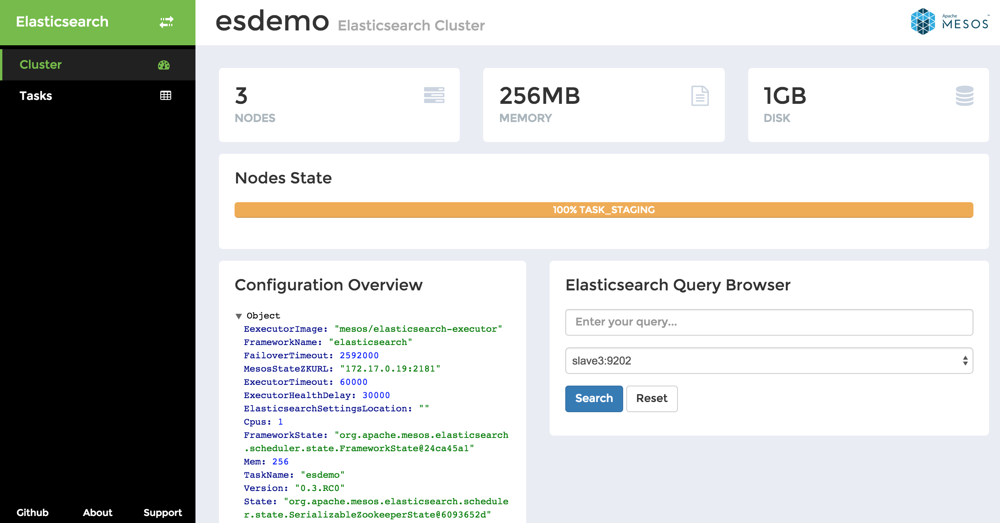
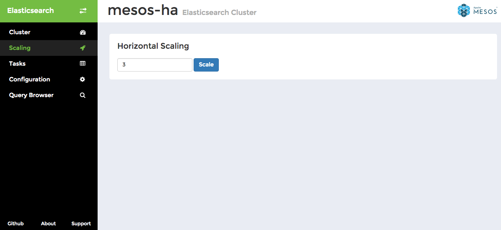
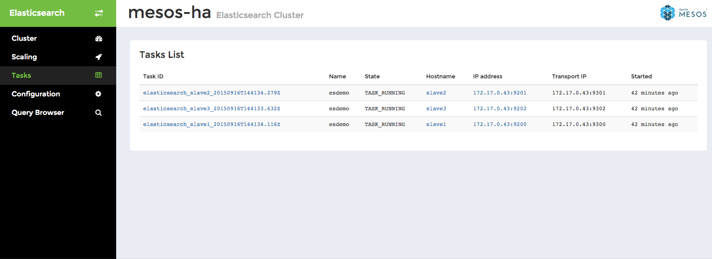
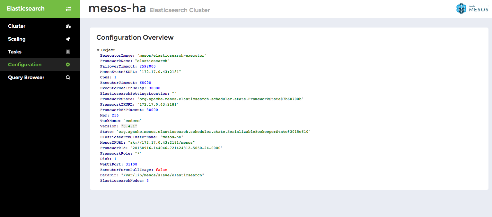
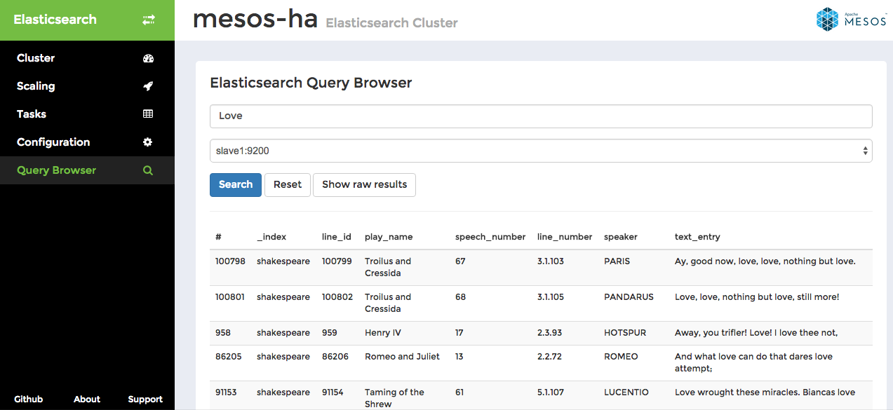

# Elasticsearch Mesos Framework

  * [Roadmap](#roadmap)
    * [Features](#features)
    * [Blocked features](#blocked-features)
    * [Developer Tools](#developer-tools)
    * [User tools](#user-tools)
    * [Certification](#certification)
  * [Getting Started](#getting-started)
  * [Users Guide](#users-guide)
    * [How to install on Marathon](#how-to-install-on-marathon)
    * [User Interface](#user-interface)
    * [Known Issues](#known-issues)
  * [Developers Guide](#developers-guide)
    * [Quickstart](#quickstart)
    * [How to run on Linux](#how-to-run-on-linux)
      * [Requirements](#requirements)
    * [How to run on Mac](#how-to-run-on-mac)
      * [Requirements](#requirements-1)
    * [System test](#system-test)
      * [How to run system tests on Linux](#how-to-run-system-tests-on-linux)
        * [Requirements](#requirements-2)
      * [How to run on Mac](#how-to-run-on-mac-1)
        * [Requirements](#requirements-3)
    * [How to release](#how-to-release)
  * [Support](#support)
  * [Sponsors](#sponsors)
  * [License](#license)


## Roadmap

### Features

- Deployment ✓
- Durable cluster topology (via ZooKeeper) ✓
- Web UI on scheduler port 31100 ✓
- Support deploying multiple Elasticsearch clusters to single Mesos cluster ✓
- Fault tolerance ✓
- Customised ES configuration ✓
- Configurable data directory ✓
- Scale cluster horizontally ✓
- Snapshot and restore ✓

[Future]

- High availability (master, indexer, replica)
- Upgrading configuration
- Scale cluster vertically
- Upgrade
- Rollback

### Blocked features

- [Persistent Volumes](https://github.com/mesos/elasticsearch/issues/228)
- [Dynamic Reservations](https://github.com/mesos/elasticsearch/issues/98)

### Developer Tools

- Local environment (Docker-machine) ✓
- Rapid code + test (Mini Mesos) ✓
- Build automation (Gradle and Jenkins) ✓

### User tools

- One click DCOS install ✓
- One JSON post to marathon install ✓

### Certification

- DCOS Certified

## Getting Started

We recommend that users install via marathon, using a docker container.

This framework requires:

* A running [Mesos](http://mesos.apache.org) cluster on version 0.25.0
* The use of <a href="https://github.com/mesosphere/marathon">Marathon</a> is strongly recommended to provide resiliency against scheduler failover.
* That the slaves have routable IP addresses. The ES ports are exposed on the slaves, so that the ES cluster can discover each other. Please double check that your slaves are routable.

## Users Guide

### Mesos version support

The framework currently supports Mesos 0.25.0. It may work with newer or older versions of Mesos, but the tests are only performed on this version.

### How to install on Marathon

Create a Marathon file like the one below and fill in the IP addresses and other configuration. This is the minimum viable command; there are many more options.

```
{
  "id": "elasticsearch-mesos-scheduler",
  "container": {
    "docker": {
      "image": "mesos/elasticsearch-scheduler",
      "network": "HOST"
    }
  },
  "args": ["--zookeeperMesosUrl", "zk://ZOOKEEPER_IP_ADDRESS:2181/mesos"],
  "cpus": 0.2,
  "mem": 512.0,
  "env": {
    "JAVA_OPTS": "-Xms128m -Xmx256m"
  },
  "instances": 1
}
```

Then post to marathon to instantiate the scheduler:
`curl -k -XPOST -d @marathon.json -H "Content-Type: application/json" http://MARATHON_IP_ADDRESS:8080/v2/apps`

Note: the JAVA_OPTS line is required. If this is not set, then the Java heap space will be incorrectly set.

Other command line options include:
```
Usage: (Options preceded by an asterisk are required) [options]
  Options:
    --dataDir
       The data directory used by Docker volumes in the executors.
       Default: /var/lib/mesos/slave/elasticsearch
    --elasticsearchClusterName
       Name of the elasticsearch cluster
       Default: mesos-ha
    --elasticsearchCpu
       The amount of CPU resource to allocate to the elasticsearch instance.
       Default: 1.0
    --elasticsearchDisk
       The amount of Disk resource to allocate to the elasticsearch instance
       (MB).
       Default: 1024.0
    --elasticsearchExecutorCpu
       The amount of CPU resource to allocate to the elasticsearch executor.
       Default: 0.1
    --elasticsearchExecutorRam
       The amount of ram resource to allocate to the elasticsearch executor
       (MB).
       Default: 32.0
    --elasticsearchNodes
       Number of elasticsearch instances.
       Default: 3
    --elasticsearchPorts
       User specified ES HTTP and transport ports.(Not recommended)
       Default: <empty string>
    --elasticsearchRam
       The amount of ram resource to allocate to the elasticsearch instance
       (MB).
       Default: 256.0
    --elasticsearchSettingsLocation
       URI to ES yml settings file. If file is copied to all slaves, the file
       must be in /tmp/config. E.g. 'file:/tmp/config/elasticsearch.yml',
       'http://webserver.com/elasticsearch.yml'
       Default: <empty string>
    --executorForcePullImage
       Option to force pull the executor image.
       Default: false
    --executorHealthDelay
       The delay between executor healthcheck requests (ms).
       Default: 30000
    --executorImage
       The docker executor image to use.
       Default: mesos/elasticsearch-executor
    --executorName
       The name given to the executor task.
       Default: elasticsearch-executor
    --executorTimeout
       The maximum executor healthcheck timeout (ms). Must be greater than
       --executorHealthDelay. Will start new executor after this length of time.
       Default: 60000
    --frameworkFailoverTimeout
       The time before Mesos kills a scheduler and tasks if it has not recovered
       (ms).
       Default: 2592000.0
    --frameworkName
       The name given to the framework.
       Default: elasticsearch
    --frameworkPrincipal
       The principal to use when registering the framework (username).
       Default: <empty string>
    --frameworkRole
       Used to group frameworks for allocation decisions, depending on the
       allocation policy being used.
       Default: *
    --frameworkSecretPath
       The path to the file which contains the secret for the principal
       (password). Password in file must not have a newline.
       Default: <empty string>
    --frameworkUseDocker
       The framework will use docker if true, or jar files if false. If false,
       the user must ensure that the scheduler jar is on all slaves.
       Default: true
    --javaHome
       (Only when --frameworkUseDocker is false) When starting in jar mode, if
       java is not on the path, you can specify the path here.
       Default: <empty string>
    --useIpAddress
       If true, the framework will resolve the local ip address. If false, it
       uses the hostname.
       Default: false
    --webUiPort
       TCP port for web ui interface.
       Default: 31100
    --zookeeperMesosTimeout
       The timeout for connecting to zookeeper for Mesos (ms).
       Default: 20000
  * --zookeeperMesosUrl
       Zookeeper urls for Mesos in the format zk://IP:PORT,IP:PORT,...)
       Default: zk://mesos.master:2181
```
### Framework Authorization
To use framework Auth, and if you are using docker, you must mount a docker volume that contains your secret file. You can achieve this by passing volume options to marathon. For example, if you wanted to use the file located at `/etc/mesos/frameworkpasswd`, then could use the following:
```
...
    "docker": {
      "image": "mesos/elasticsearch-scheduler",
      "network": "BRIDGE"
    },
    "volumes": [
      {
        "containerPath": "/etc/mesos/frameworkpasswd",
        "hostPath": "/etc/mesos/frameworkpasswd",
        "mode": "RO"
      }
    ]
  },
...
```
Please note that the framework password file must only contain the password (no username) and must not have a newline at the end of the file. (Marathon bugs)

### Using JAR files instead of docker images
It is strongly recommended that you use the containerized version of Mesos Elasticsearch. This ensures that all dependencies are met. Limited support is available for the jar version, since many issues are due to OS configuration. However, if you can't or don't want to use containers, use the raw JAR files in the following way:
1. Requirements: Java 8, Apache Mesos.
2. Set the CLI parameter frameworkUseDocker to false. Set the javaHome CLI parameter if necessary.
3. Run the jar file manually, or use marathon. Normal command line parameters apply. For example:
```
{
  "id": "elasticsearch",
  "cpus": 0.2,
  "mem": 512,
  "instances": 1,
  "cmd": "java -jar scheduler-0.7.0.jar --frameworkUseDocker false --zookeeperMesosUrl zk://10.0.0.254:2181 --frameworkName elasticsearch --elasticsearchClusterName mesos-elasticsearch --elasticsearchCpu 1 --elasticsearchRam 1024 --elasticsearchDisk 1024 --elasticsearchNodes 3 --elasticsearchSettingsLocation /home/ubuntu/elasticsearch.yml",
  "uris": [ "https://github.com/mesos/elasticsearch/releases/download/0.7.0/scheduler-0.7.0.jar" ],
  "env": {
    "JAVA_OPTS": "-Xms256m -Xmx512m"
  },
  "ports": [31100],
  "requirePorts": true,
  "healthChecks": [
    {
      "gracePeriodSeconds": 120,
      "intervalSeconds": 10,
      "maxConsecutiveFailures": 6,
      "path": "/",
      "portIndex": 0,
      "protocol": "HTTP",
      "timeoutSeconds": 5
    }
  ]
}
```

Jars are available under the (releases section of github)[https://github.com/mesos/elasticsearch/releases].

### User Interface

The web based user interface is available on port 31100 of the scheduler by default. It displays real time information about the tasks running in the cluster and a basic configuration overview of the cluster. 

The user interface uses REST API of the Elasticsearch Mesos Framework. You can find the API documentation here: [docs.elasticsearchmesos.apiary.io](http://docs.elasticsearchmesos.apiary.io/).

#### Cluster Overview



Cluster page shows on the top the number of Elasticsearch nodes in the cluster, the overall amount of RAM and disk space allocated by the cluster. State of individual nodes is displayed in a bar, one color representing each state and the percentage of nodes being in this state.

Below you can see Performance Overview with the following metrics over time: number of indices, number of shards, number of documents in the cluster and the cluster data size.

#### Scaling 



This simple interface allows you to specify a number of nodes to scale to.

#### Tasks List



Tasks list displays detailed information about all tasks in the cluster, not only those currently running, but also tasks being staged, finished or failed. Click through individual tasks to get access to Elasticsearch REST API.

#### Configuration



This is a read-only interface displaying an overview of the framework configuration.

#### Query Browser



Query Browser allows you to examine data stored on individual Elasticsearch nodes. In this example we searched for the word "Love" on `slave1` node. You can toggle between tabular view and raw results view mode, which displays the raw data returned from Elasticsearch `/_search` API endpoint.

### Known issues

- Issue [#177](https://github.com/mesos/elasticsearch/issues/177#issuecomment-135367451): Executors keep running if the scheduler is killed unless the DCOS CLI is used.

## Developers Guide

For developers, we have provided a range of tools for testing and running the project. Check out the [minimesos](https://github.com/containersolutions/minimesos) project for an in-memory Mesos cluster for integration testing.

### Quickstart

You can run Mesos-Elasticsearch using <a href="https://github.com/containersolutions/minimesos">minimesos</a>, a containerized Mesos cluster for testing frameworks.

### How to run on Linux

#### Requirements

* Docker

```
$ ./gradlew build buildDockerImage system-test:main
```

### How to run on Mac 

#### Requirements

* Docker Machine

```
$ docker-machine create -d virtualbox --virtualbox-memory 4096 --virtualbox-cpu-count 2 mesos-es
$ eval $(docker-machine env mesos-es)
$ sudo route delete 172.17.0.0/16; sudo route -n add 172.17.0.0/16 $(docker-machine ip mesos-es)
$ ./gradlew build buildDockerImage system-test:main
```

### System test

The project contains a system-test module which tests if the framework interacts correctly with Mesos, using <a href="https://github.com/containersolutions/minimesos">minimesos</a>. We currently test Zookeeper discovery and the Scheduler's API by calling endpoints and verifying the results. As the framework grows we will add more system tests.

#### How to run system tests on Linux

##### Requirements

* Docker

Run all system tests

```
$ ./gradlew build buildDockerImage system-test:systemTest
```

Run a single system test

```
$ ./gradlew -DsystemTest.single=DiscoverySystemTest system-test:systemTest
```

### How to release

1. First update the CHANGELOG.md by listing fixed issues and bugs
2. Update the version number in the Configuration.class so that the Web UI shows the correct version number.
3. Push changes
4. Verify that the [Continuous Build Pipeline](https://ci.infra.container-solutions.com/) completes successfully.
5. Run the [Release Build](https://ci.infra.container-solutions.com/view/Mesos%20Elasticsearch/job/Elasticsearch%20Release/) and pick a release type: patch, minor or major.
6. Done!

## Support

Get in touch with the Elasticsearch Mesos framework developers via [mesos-es@container-solutions.com](mesos-es@container-solutions.com)

## Sponsors

This project is sponsored by Cisco Cloud Services

## License

Apache License 2.0
